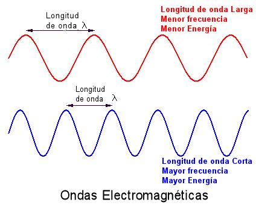
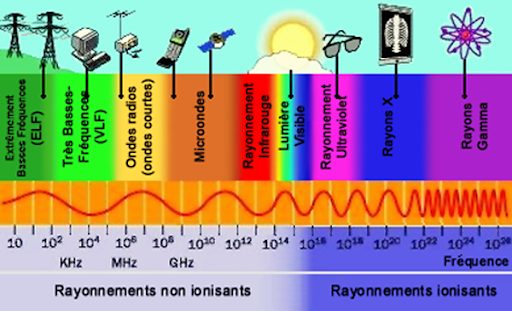
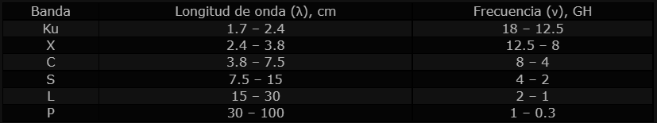
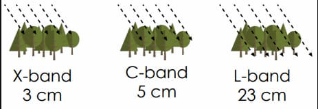
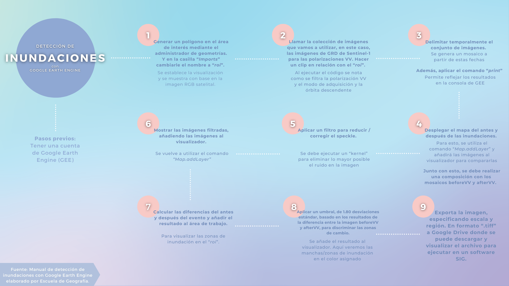

# TP5 Fotogrametría y Teledetección

### Elaborado por Marget Martínez y Daniela Amador

# Definición de conceptos

## 1. Microondas

Según lo visto en clase, las microondas son un tipo de onda electromagnética perteneciente al espectro electromagnético. Generalmente tiene frecuencias entre 300 Mhz y 30 Ghz. Están situadas entre los rayos infrarrojos (cuya frecuencia es mayor) y las ondas de radio convencionales. Y la longitud de onda va aproximadamente desde 1 mm hasta 30 cm.

 

En esta primer imagen, podemos observar cómo funcionan las longitudes de onda

En cuanto al espectro electromagnético, estas ondas se encuentran en una ventana atmosférica, esto permite que la señal se transmita hasta la superficie terrestre. Son precisamente estas ventanas atmosféricas el equivalente a las bandas.

A continuación, se presentan ilustraciones para ejemplificar mejor el concepto:

La imagen nos ilustra la ubicación de las ondas de microondas en el espectro electromagnético. Las ventanas atmosféricas o bandas son una de las principales razones de la existencia de la teledetección.

## 2. Retrodispersión y Constante dieléctrica

De acuerdo a lo visto en clase, la retrodispersión es lo que mide el sensor SAR. Esta es la energía de microondas que regresa al sensor SAR luego de interactuar con la superficie. Es la energía reflejada hacia el radar nuevamente. Por lo que la intensidad de la retrodispersión está relacionada directamente con el tipo de cobertura y las características que tenga esta. Por lo que al saber la intensidad de esta se puede evaluar el estado de las coberturas y las características de esta. Esta puede ser especular (superficies lisas/agua abierta), por volumen (dosel del bosque), por doble rebote (bosques/infraestructura) y rugosa (zonas agrícolas). 

Esta nos muestra los tipos de retrodispersión en función de la superficie donde rebota.

Por otro lado, la constante dieléctrica es un parámetro de cobertura que indica la reflectividad y conductividad de la superficie. “Dieléctrico” se refiere a los materiales que no son conductores. Cuando las longitudes de onda viajan por estos materiales, pierden energía, y esta pérdida es exponencial, por lo que la onda pierde amplitud al propagarse por el medio. Por lo tanto, la corriente dieléctrica permite inferir la cantidad de energía de la onda que se dispersa o se absorbe al interactuar con la superficie. Se expresa de 0 a 80 y los materiales que menos reflejan son los más secos, por otro lado los que tienen mayor constante dieléctrica son las aguas abiertas.

Se muestra el funcionamiento de la constante dieléctrica, siendo las flechas grises, energía reflejada con menor intensidad debido a las características de la superficie.

## 3. Bandas en RADAR para aplicaciones ambientales

Para poder entender y definir las bandas en RADAR es necesario retomar el concepto de longitud de banda. Como se vio en clase, en el SAR también se definen las bandas acordes a la longitud de onda, pero en este solo capturan información en una banda determinada. Es la longitud de onda la que definirá la interacción de la señal con la superficie. En realidad son tres los parámetros del RADAR que tendrán influencia sobre las características de la señal retrodispersada: como ya se mencionó longitud de onda, la polarización y el ángulo de incidencia. 

Las longitudes de onda o bandas más utilizadas son: 

De las bandas anteriores las más utilizadas para aplicaciones ambientales son las bandas X (Agricultura, océano, radar de alta resolución), C (Océano, agricultura) y la L (Agricultura, gestión forestal, humedad del suelo). 

La imagen nos ilustra cómo en áreas de cobertura forestal la banda X penetrará la parte superior del dorsal de la vegetación. La banda C penetrará más profundamente y la banda L en la mayoría de los casos penetrará hasta llegar al suelo.

## 4. RADAR de Apertura Sintética

El SAR es uno de los sensores que se utilizan para obtener imágenes de la superficie terrestre. Este envía pulsos electromagnéticos a la tierra con el fin de captar estas ondas una vez reflejadas por la superficie y con ello obtener imágenes del área que llega a iluminar. Este sensor no necesita otras fuentes de iluminación como la luz solar, que se necesita en los sensores ópticos. Por lo que se pueden operar las 24 horas del día y las ondas se encuentran en el espectro de las microondas. Pueden verse afectadas por la humedad. Por otro lado, una de sus características distintivas es la consecución de altas resoluciones en la dirección del movimiento del sensor mediante la síntesis de una antena de grandes dimensiones a partir de una antena real más pequeña (Gimeno, 2019).

En esta imagen se puede observar la geometría en la que consiste un sensor SAR.

# Flujo de trabajo: Detección de Inundaciones

# Flujo de trabajo: Índice de Vegetación

# Resultados y Conclusiones
- Inundaciones

- Índices de Vegetación

Las imágenes anteriores corresponden a los índices de vegetación correspondientes para las fechas "2020-02-01" y "2022-03-13" respectivamente. Respecto a ellas podemos saber que los valores de los índices son mayores en la primera imagen. Esto podemos saberlo gracias a el inspector de GEE, el cual nos permite observar los valores de las constantes para cada pixel. Lo que vendría a equivaler al valor del índice de vegetación. Entre más cercano a 1 quiere decir que existe mayor cantidad de vegetación. Lo que se puede observar fácilmente en los tonos (colores) de cada pixel, entre más claros (hacia verde en este caso), más cercano a 1 se encuentra. Por otro lado, se observan resultados y valores menores en la segunda imagen. Esto puede deberse a periodos de cosecha, donde se corta la vegetación en etapa madura (en este caso debido a las plantaciones de caña).  

# Referencias bibliográficas

- Gimeno Martínez, N. (1 Abril, 2019). ¿Qué es un SAR? *Instituto Nacional de Técnica Aeroespacial.* España. https://www.inta.es/INTA/es/blogs/ceit/BlogEntry_1554121012176
